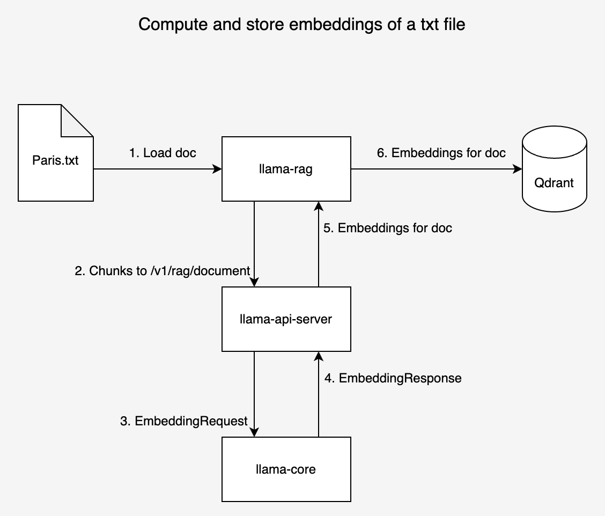
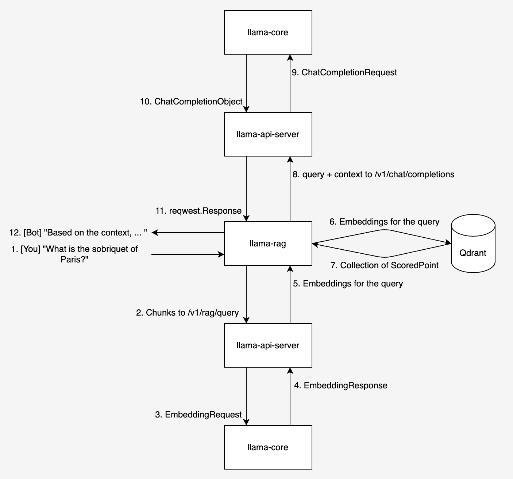

# The Example-LlamaEdge-RAG repo is replaced by the [LlamaEdge/RAG-API-Server](https://github.com/LlamaEdge/rag-api-server) repo. 

If you want to build a RAG application with one single binary, go to check out 

* Rag-api-server repo: https://github.com/LlamaEdge/rag-api-server
* Docs: https://llamaedge.com/docs/intro/


---
# ChatBot on LlamaEdge RAG

This repository demonstrates a RAG chatbot powered by LlamaEdge RAG. The chatbot uses

- The `/v1/embedding` endpoint of the `llama-api-server` to (1) compute the embeddings for the given document and (2) persist the embeddings in the specified Qdrant DB.

- The `/v1/chat/completions` endpoint of the `llama-api-server` to (1) compute the embeddings for the user question; (2) query the Qdrant DB and retrieve the most similar documents to the user's input; (3) generate the completions for the user's input.

Note that it is required to specify `--qdrant-url`, `--qdrant-collection-name`, `--qdrant-limit` CLI options while starting the `llama-api-server` to enable the RAG service.

The entire workflow is depicted in the diagrams in the [Workflow](#workflow) section.

If you'd like to use `curl` to interact with LlamaEdge RAG endpoints, you can refer to [curl.md](curl.md).

## Setup

- Install `WasmEdge Runtime`

  ```console
  curl -sSf https://raw.githubusercontent.com/WasmEdge/WasmEdge/master/utils/install.sh | bash -s -- -v 0.13.5  --plugins wasi_nn-ggml wasmedge_rustls
  ```

- Start Qdrant docker container

  ```console
  # Pull the Qdrant docker image
  docker pull qdrant/qdrant

  # Create a directory to store Qdrant data
  mkdir qdrant_storage

  # Run Qdrant service
  docker run -p 6333:6333 -p 6334:6334 -v $(pwd)/qdrant_storage:/qdrant/storage:z qdrant/qdrant
  ```

- Start `llama-api-server`

  ```bash
  wasmedge --dir .:. --nn-preload default:GGML:AUTO:Llama-2-7b-chat-hf-Q5_K_M.gguf llama-api-server.wasm --prompt-template llama-2-chat --ctx-size 4096 --qdrant-url http://127.0.0.1:6333 --qdrant-collection-name "paris" --qdrant-limit 3
  ```

## Usage

- Build and run

  ```console
  # clone the repository
  git clone https://github.com/LlamaEdge/Example-LlamaEdge-RAG.git
  cd Example-LlamaEdge-RAG

  # build the executable
  cargo build --release

  # run the executable
  ./target/release/llama-rag --file paris.txt
  ```

  If the command runs successfully, you will see the following output:

  ```console
  [INFO] Document: paris.txt

  [+] Chunking the document ...
  [+] Computing the embeddings for the document ...

  [You]:
  What is the sobriquet of Paris, France?

  [Bot]:
  Based on the provided context, the sobriquet of Paris, France is "the City of Light" (French: "la Ville Lumière").


  [You]:
  What is the location of Paris, France on the Seine River?

  [Bot]:
  According to the provided text, Paris is situated along the Seine River some 233 miles (375 km) upstream from the river’s mouth on the English Channel (La Manche). Therefore, the location of Paris, France on the Seine River is approximately 233 miles (375 km) upstream from the river's mouth.
  ```

## Workflow

- Compute and store embeddings for a given text file

  <!--  -->

  

- RAG-based chatbot

  <!--  -->

  
