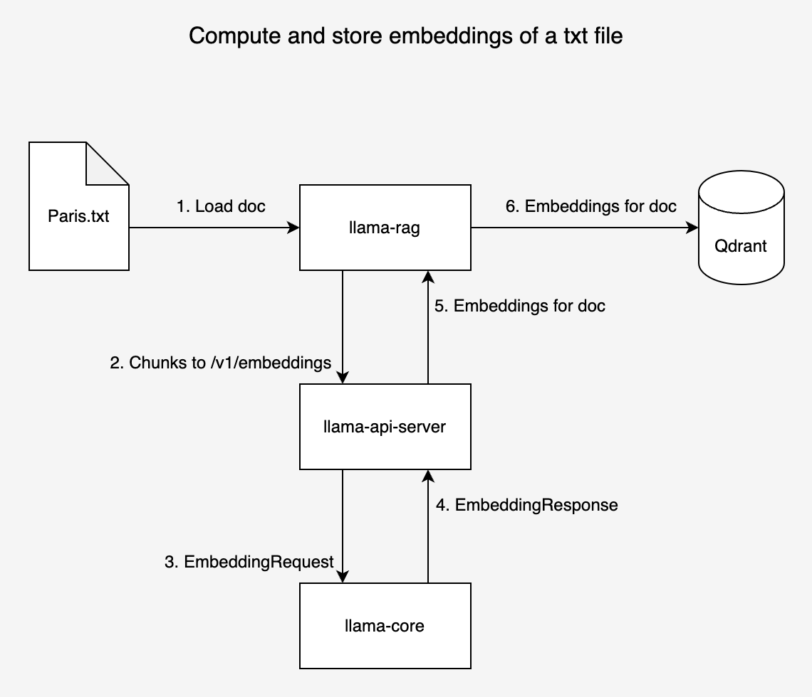
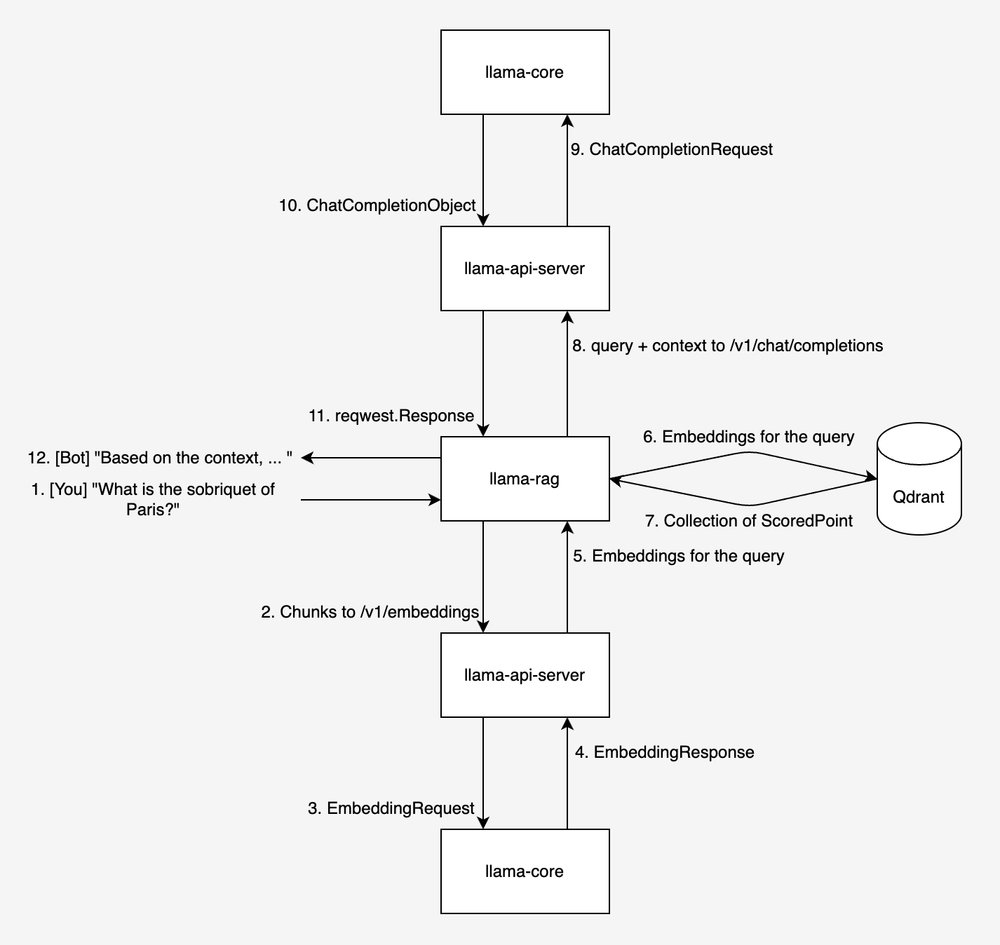

# ChatBot on LlamaEdge RAG

This repository demonstrates a RAG chatbot powered by LlamaEdge RAG. The chatbot uses

- `/v1/rag/document` endpoint of the `llama-api-server` to (1) compute the embeddings for the given document and (2) persist the embeddings in the specified Qdrant DB.

- `/v1/rag/query` endpoint of the `llama-api-server` to (1) compute the embeddings for the user question and (2) query the Qdrant DB and retrieve the most similar documents to the user's input.

- `/v1/chat/completions` endpoint of the `llama-api-server` to generate the completions for the user's input.

The entire workflow is depicted in the diagrams in the [Workflow](#workflow) section.

## Setup

- Install `WasmEdge Runtime`

  ```console
  curl -sSf https://raw.githubusercontent.com/WasmEdge/WasmEdge/master/utils/install.sh | bash -s -- -v 0.13.5  --plugins wasi_nn-ggml wasmedge_rustls
  ```

- Start `llama-api-server`

  ```bash
  wasmedge --dir .:. --nn-preload default:GGML:AUTO:Llama-2-7b-chat-hf-Q5_K_M.gguf llama-api-server.wasm --prompt-type llama-2-chat --ctx-size 4096
  ```

- Start Qdrant docker container

  ```console
  # Pull the Qdrant docker image
  docker pull qdrant/qdrant

  # Create a directory to store Qdrant data
  mkdir qdrant_storage

  # Run Qdrant service
  docker run -p 6333:6333 -p 6334:6334 -v $(pwd)/qdrant_storage:/qdrant/storage:z qdrant/qdrant
  ```

## Usage

- Build

  ```console
  # clone the repository
  git clone https://github.com/second-state/llama-embeddings.git
  cd llama-embeddings

  # build the wasm file
  cargo build --target wasm32-wasi --release
  ```

  Then, copy the generated `target/wasm32-wasi/release/llama_embeddings.wasm` to `llama-embeddings.wasm` in the root of this repository.

- Run

  ```bash
  wasmedge --dir .:. llama-rag.wasm --file paris.txt --qdrant-url http://127.0.0.1:6333
  ```

  If the command runs successfully, you will see the following output:

  ```console
  [INFO] Document: paris.txt
  [INFO] Qdrant URL: http://127.0.0.1:6333
  [INFO] Qdrant Collection Name: paris
  [INFO] Max number of retrieved results: 3


  [+] Chunking the document ...
  [+] Computing the embeddings for the document ...

  [You]:
  What is the sobriquet of Paris, France?

  [Bot]:
  Based on the provided context, the sobriquet of Paris, France is "the City of Light" (French: "la Ville Lumière").


  [You]:
  What is the location of Paris, France on the Seine River?

  [Bot]:
  According to the provided text, Paris is situated along the Seine River some 233 miles (375 km) upstream from the river’s mouth on the English Channel (La Manche). Therefore, the location of Paris, France on the Seine River is approximately 233 miles (375 km) upstream from the river's mouth.
  ```

## Workflow

- Compute and store embeddings for a given text file

  <!--  -->

  

- RAG-based chatbot

  <!--  -->

  
